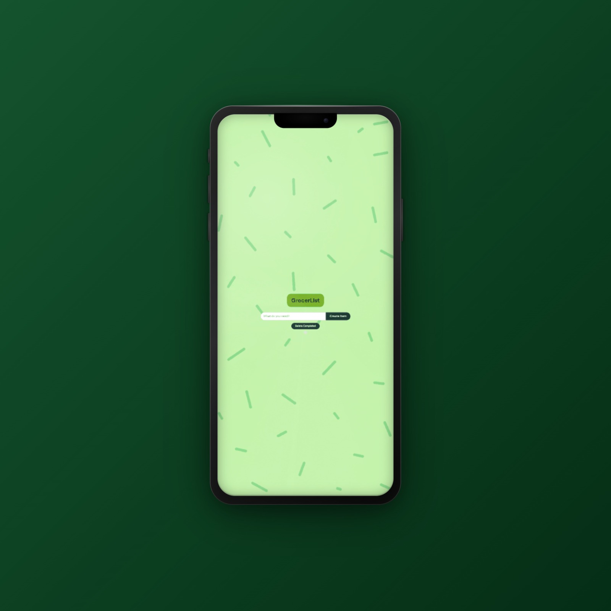

# 🛒 The Grocer List

The Grocer List is a simple, interactive grocery shopping list built with HTML, CSS, and JavaScript. It allows shoppers to quickly add items, mark them off as they shop, and remove completed items from their list.

I built this project to practice JavaScript DOM manipulation and event handling while turning a traditional to-do list into something designed around an everyday use case.

[View Live Project](https://funny-swan-8c6a07.netlify.app/)

## 📸 Project Preview

## ✨ Features

- Add grocery items to your shopping list
- Click an item to mark it as completed
- Remove completed items from the list
- Responsive design for use across different screen sizes
- Simple interface designed for quick use while shopping

## 🛠️ Built With

- HTML5
- CSS3
- JavaScript

## 🧠 What I Learned

This project helped me strengthen my understanding of:

- Selecting and manipulating elements in the DOM
- Creating new HTML elements with JavaScript
- Using event listeners to respond to user interactions
- Adding and removing CSS classes dynamically
- Appending elements to a webpage
- Connecting HTML, CSS, and JavaScript to create an interactive experience
- Building responsive layouts for different screen sizes

## 🛒 How It Works

Enter an item you need and add it to your grocery list. While shopping, click an item to mark it as completed. Once you're finished, use the delete completed button to clear the items you've already picked up.